# 🧠 Allapu Srivarshan

<div align="center">
  
</div>

---

## 🎯 Professional Overview

> "Technology and data are powerful only when used to solve meaningful problems. I aim to bridge knowledge and impact through continuous learning and innovation."

I'm a *high-achieving Computer Science and Engineering (Data Science) student* with an exceptional *9.05 SGPA* at *SR University*. My passion lies in transforming complex data into actionable insights through *SQL mastery*, *Python programming*, and *Business Intelligence solutions* that drive real-world business decisions.

```python
class AllapuSrivarshan:
    def __init__(self):
        self.name = "Allapu Srivarshan"
        self.role = "Aspiring Data Analyst | Software Engineer"
        self.education = {
            "degree": "B.Tech CSE (Data Science)",
            "college": "SR University",
            "hall_ticket": "2203A54042",
            "semester": "4-1",
            "sgpa": 9.05,
            "status": "Consistent Academic Performer"
        }
        self.expertise = [
            "Data Analytics", "Business Intelligence", "SQL Optimization",
            "Web Development", "Database Management", "Problem Solving"
        ]
        self.tech_stack = {
            "languages": ["SQL", "Python", "HTML", "CSS", "JavaScript"],
            "analytics_tools": ["Power BI", "Excel", "Pandas", "NumPy"],
            "databases": ["MySQL", "PostgreSQL", "SQL Server", "SSMS"],
            "cloud": ["Microsoft Azure"],
            "development": ["Git", "GitHub"]
        }
        self.achievements = [
            "Data Analytics Virtual Internship - Deloitte (Forage)",
            "Database Engineer (SQL) - Meta/HackerRank",
            "Power BI Dashboarding - Microsoft Learn",
            "Python Programming - NPTEL"
        ]
        self.current_projects = [
            "Zomato Sales Analytics Dashboard",
            "Financial Anomaly Detection System"
        ]
    
    def get_vision(self):
        return "Building data-driven solutions that help businesses make better decisions"
    
    def get_motto(self):
        return "Consistency + Curiosity = Growth"
    
    def current_focus(self):
        return {
            "learning": ["Advanced SQL", "DSA", "System Design", "Query Optimization"],
            "building": ["Analytics Dashboards", "Data-Driven Applications"],
            "competing": ["LeetCode Problem Solving", "SQL Challenges"],
            "goal": "Data Analyst / Software Engineer at top companies"
        }

srivarshan = AllapuSrivarshan()
print(f"Vision: {srivarshan.get_vision()}")
print(f"Motto: {srivarshan.get_motto()}")
```

---

## 🎓 Academic Excellence

<div align="center">

| 📚 *Degree* | 🏛 *Institution* | 📅 *Duration* | 📊 *Performance* | 🎯 *Status* |
|:---:|:---:|:---:|:---:|:---:|
| *B.Tech CSE (Data Science)* | SR University | Oct 2022 - May 2026 | *9.05/10.0 SGPA* ⭐ | *Top Performer* |

</div>

---

## 🏆 Professional Certifications & Achievements

<div align="center">

| 🎖 *Certification* | 🏢 *Provider* | 📋 *Category* | 🔗 *Status* |
|:---:|:---:|:---:|:---:|
| *Data Analytics Virtual Internship* | Deloitte (Forage) | Analytics & BI | ✅ *Completed* |
| *Data Analytics Virtual Internship* | Accenture (Forage) | Analytics & BI | ✅ *Completed* |
| *Data Analytics Virtual Internship* | Tata (Forage) | Analytics & BI | ✅ *Completed* |
| *Database Engineer (SQL)* | Meta / HackerRank | Databases | ✅ *Certified* |
| *Power BI Dashboarding* | Microsoft Learn | Business Intelligence | ✅ *Completed* |
| *Theory Of Computation* | NPTEL | Computer Science | ✅ *Certified* |

</div>

---

## 🛠 *Tech Stack Overview*

<div align="center">

### 💻 *Programming Languages*


### 📊 *Data Analytics & BI*


### 🗄 *Databases*

<br>


### ☁ *Cloud & Tools*


### 🏆 *Competitive Platforms*


</div>

<details>
<summary>📋 <b>Detailed Technical Proficiency</b></summary>

### 💻 *Core Programming*


### 📊 *Data Analytics & BI*


### 🗄 *Databases*


### ☁ *Cloud & DevOps*


### 🏆 *Competitive Programming*


</details>

---

## 🌟 Flagship Projects

<div align="center">
  <table>
    <tr>
      <td width="50%">
        <h3 align="center">🍽 Zomato Sales Analytics</h3>
        <div align="center">
          <a href=https://github.com/Srivarshan-Allapu/Zomato-Restaurant-Orders-Analysis-Using-SQL target="_blank">
            
          </a>
          <br><br>
          <p>
            <b>🎯 Impact:</b> Identified top 20% products driving 80% revenue<br>
            <b>🔧 Tech Stack:</b> PostgreSQL, Power BI, Advanced SQL<br>
            <b>📊 Achievement:</b> Optimized queries, improved delivery insights<br>
            <b>🌱 Domain:</b> Business Intelligence & Food Analytics
          </p>
        </div>
      </td>
      <td width="50%">
        <h3 align="center">💹 Product Sales Analysis</h3>
        <div align="center">
          <a href=https://github.com/Srivarshan-Allapu/Product-Sales-Analysis-With-Postgrsql target="_blank">
            
          </a>
          <br><br>
          <p>
            <b>🎯 Impact:</b> Detected 50+ anomalies with 95% accuracy<br>
            <b>🔧 Tech Stack:</b> Power BI, Python, Data Cleaning<br>
            <b>📊 Achievement:</b> Enhanced fraud detection analytics<br>
            <b>🌱 Domain:</b> Financial Analytics & Risk Management
          </p>
        </div>
      </td>
    </tr>
  </table>
</div>

---

## 📈 Performance Analytics

### 🏅 *GitHub Statistics*
<div align="center">
  
  
</div>

<div align="center">
  
</div>

### 💻 *LeetCode Journey*
<div align="center">
  
</div>

### 📊 *GitHub Activity*
<div align="center">
  
</div>

---

## 🚀 Current Learning Journey

```mermaid
%%{init: {"theme": "default", "themeVariables": {
  "background": "#ffffff",
  "primaryColor": "#e0f7fa",
  "primaryTextColor": "#000000",
  "primaryBorderColor": "#00acc1",
  "lineColor": "#00796b",
  "secondaryColor": "#b2dfdb",
  "tertiaryColor": "#80cbc4"
}}}%%
mindmap
  root((🧠 Srivarshan's Learning Path))
    🌐 Advanced SQL
      ⚙️ Window Functions Mastery
      🚀 Query Optimization Techniques
      🔗 Complex Joins & Subqueries
      ⚡ Performance Tuning
    🧩 Data Structures & Algorithms
      🌀 Dynamic Programming
      🕸 Graph Algorithms
      🏆 Competitive Programming
      🧭 Problem Solving Strategies
    📊 Business Intelligence
      📈 Advanced Power BI Dashboards
      🧮 Data Modeling Best Practices
      🔄 ETL Pipeline Development
      ⏱ Real-time Analytics
    💻 Web Development
      📊 Interactive Data Visualizations
      ⚛️ JavaScript Framework Integration
      🧱 Responsive Dashboard Design
      🌍 Full-Stack Development
```

<div align="center">




</div>

---

## 🎯 Career Roadmap & Goals

<div align="center">

| 🎯 *Short Term (2024-2025)* | 🚀 *Medium Term (2025-2027)* | 🌟 *Long Term (2027+)* |
|:---:|:---:|:---:|
| ✅ Master Advanced SQL & DSA | 🎯 *Data Analyst* at Top Tech Company | 🚀 *Lead Data Engineer* Role |
| ✅ Build 5+ Production BI Projects | 📊 Work on Large-Scale Analytics Systems | 🌍 *Senior Analytics Manager* |
| ✅ Achieve Industry Certifications | 📝 Publish Data Insights & Case Studies | 🏢 *Tech Leadership* in Analytics |
| ✅ LeetCode 300+ Problems Solved | 🏆 Lead Analytics Teams & Mentor | 🌱 *Entrepreneurship* in Data Tech |
| ✅ Create Professional Portfolio | 🤝 Drive Business Intelligence Strategy | 📈 *Thought Leadership* in BI Community |

</div>

---

## 📧 Connect & Collaborate

<div align="center">

[](mailto:srivarshanallapu6@gmail.com)
[](https://www.linkedin.com/in/srivarshan-allapu-692700283/)
[](https://github.com/Srivarshan-Allapu)
[](https://leetcode.com/u/Allapu_Srivarshan/)
[](https://drive.google.com/file/d/1QQQr5U3eLsZmrIyjieqaie226JIXun03/view?usp=sharing)

</div>

---

## 💡 Professional Philosophy

<div align="center">
  <blockquote>
    <p><em>"Consistency and curiosity drive my journey in technology. Every dataset I analyze, every query I optimize, and every project I build is a step toward creating impactful solutions that bridge the gap between data and decision-making."</em></p>
    <footer>— <strong>Allapu Srivarshan</strong></footer>
  </blockquote>
</div>

---

<div align="center">
  
</div>

<div align="center">
  <sub>🚀 <i>"Excellence is a continuous journey of learning, building, and creating meaningful impact through data-driven solutions."</i></sub>
</div>

---

<div align="center">
  
  
  
</div>
